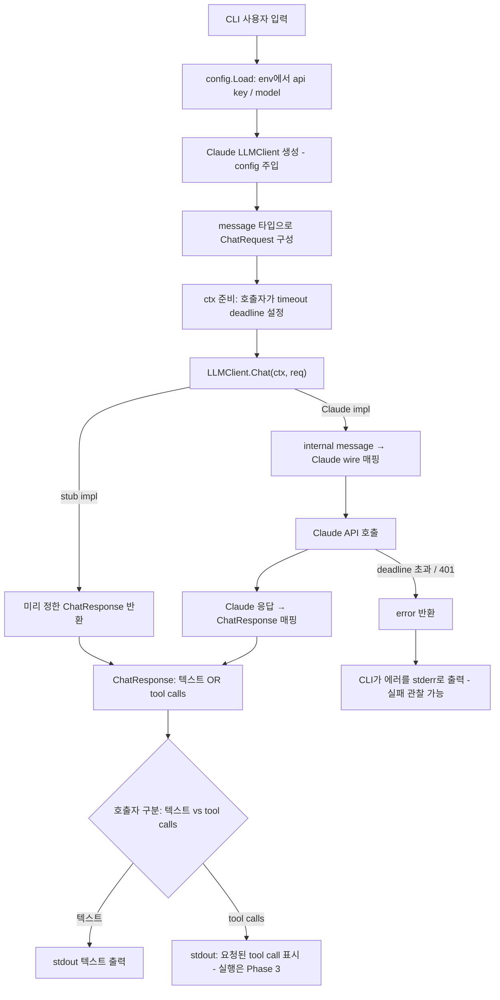

# analysis: phase-1-llm-client

## 근거

이 분석은 `spec.md` §1~§5 전체를 읽고, ROADMAP Phase 0~1과 README의 설계 원칙
("Runtime과 Provider를 분리한다", "Tool은 schema-first", "모든 실행은 제한한다",
"Trace를 남긴다", "LangChain / LangGraph만 금지한다")을 근거로 작성했다.

### 확인된 사실 (repo 상태)

- `find . -type f -not -path './.git/*'` 결과 소스 코드가 전혀 없다. 존재하는 파일은
  `README.md`, `ROADMAP.md`, `.gitignore`, `.idea/*`, 그리고 본 feature-dir 문서뿐이다.
- `go.mod`가 없다. 즉 Go module 자체가 초기화되어 있지 않다.
- README "프로젝트 구조"에 그려진 디렉터리 트리(`cmd/`, `internal/...`)는 목표 구조이며
  실제 디스크에는 존재하지 않는다. 디렉터리는 모두 신규 생성 대상이다.
- ROADMAP Phase 0(Project Foundation: go module, config loader, logger, CLI entry,
  `.env` 로딩)이 명목상 선행 단계지만 코드는 존재하지 않는다.
- `.gitignore`는 이미 `.env`를 무시하도록 설정되어 있다 (Decision 6 관련).

### 가정

- 본 Phase는 Phase 0 전부를 완성하는 것이 목표가 아니다. spec §5 완료 조건을
  관찰 가능하게 만드는 데 필요한 최소 부트스트랩(`cmd/agent-runtime`의 최소 CLI,
  `internal/config`)까지만 포함한다. logger 정식화·`.env` 자동 로딩 같은 Phase 0의 잔여
  항목은 본 Phase 완료 조건이 요구하지 않으므로 범위 밖으로 둔다.
- **Go module 초기화(`go mod init`)는 사용자가 직접 수행하는 선행 작업이며 본 Phase 산출물
  범위에서 제외한다.** 즉 implement 시작 시점에 `go.mod`가 이미 존재한다고 전제한다. 외부
  의존성(Anthropic Go SDK)을 추가하는 `go get`·`go mod tidy`는 구현 작업의 일부로 수행한다.
- Go 버전은 최신 안정 버전(1.22+)을 가정한다. 정확한 버전은 사용자가 `go mod init` 시 확정한다.
- spec §4에 따라 tool call / tool result는 본 Phase에서 **타입 정의와 응답 구분**까지만
  다룬다. 실제 tool 등록·실행은 Phase 3 범위다.

## 1. 구조

본 Phase의 코드 경계는 ROADMAP Phase 1 주요 패키지(`internal/llm`, `internal/message`,
`internal/config`)와 §5.1을 위한 CLI 진입점(`cmd/agent-runtime`)이다. `go.mod`는 사용자가
선행으로 초기화하므로(§근거) 아래 트리에서 산출 대상은 패키지 코드뿐이다.

```text
agent-runtime/
├── go.mod                         (사용자 선행 — 본 Phase 산출 대상 아님)
├── cmd/
│   └── agent-runtime/
│       └── main.go                (CLI 진입점, §5.1)
└── internal/
    ├── config/                    (model / api key 주입, §5.5)
    ├── message/                   (provider-neutral 메시지 타입, §5.4)
    └── llm/                       (LLMClient interface + Claude impl + stub + req/resp)
```

### 계층·경계

- **`internal/message`** — Runtime 전체에서 공유하는 provider-neutral 메시지 타입의
  단일 소유처다. user / assistant / tool / system 메시지, tool call, tool result를
  정의한다(§5.4). Claude·GPT 등 특정 wire 포맷에 대한 지식을 담지 않는다. 이 패키지는
  `internal/llm`을 import하지 않는다(역방향 의존만 허용 → 순환 방지). 이후 Phase 2~3의
  AgentState·Tool Runtime이 이 타입 위에 세워지므로, 가장 아래 계층에 둔다.

- **`internal/llm`** — Provider 추상화 계층(§5.2, README "Runtime과 Provider를 분리한다").
  세 가지 책임을 분리한다:
  - `LLMClient` interface: 호출자가 의존하는 유일한 계약. 구현체 타입에 직접 의존하지
    않는다(spec §3).
  - request / response 모델(`ChatRequest`, `ChatResponse`): provider-neutral.
    `[]message.Message`를 담아 전달한다(§5.3, §5.4).
  - Claude 구현체: 실제 API 호출 + internal 메시지 ↔ Claude wire 포맷 매핑을 **이 안에**
    가둔다(Decision 7). internal 타입을 provider-neutral하게 유지하는 핵심 경계다.
  - stub 구현체: 같은 interface를 만족하며 미리 정해둔 응답을 반환한다(§5.7). 텍스트 응답과
    tool call 응답을 모두 흉내낼 수 있어야 §5.3 구분을 결정적으로 테스트할 수 있다.

- **`internal/config`** — api key / model을 환경변수에서 읽어 구조체로 제공한다(§5.5).
  소스 변경 없이 key·model을 바꿀 수 있게 하는 경계. `internal/llm`이 이 config를 받아
  Claude 클라이언트를 생성한다.

- **`cmd/agent-runtime`** — CLI 진입점(§5.1). config 로드 → LLMClient 생성(기본 Claude) →
  사용자 입력으로 `ChatRequest` 구성 → `Chat(ctx)` 호출 → 응답을 텍스트/tool call로 구분해
  stdout 출력. main은 `LLMClient` interface에만 의존하고 구체 타입을 노출하지 않는다.

의존 방향은 `cmd/agent-runtime → internal/llm → internal/message`,
`cmd/agent-runtime → internal/config → internal/llm`(생성 시 주입) 한 방향이다.
`internal/message`는 어디에도 의존하지 않는 최하위 leaf다.

## 2. 데이터 흐름

정상 경로와 실패 경로(timeout / 잘못된 key)를 함께 표현한다.



흐름 요약:

1. CLI가 사용자 프롬프트를 받는다(§5.1).
2. `config.Load`가 환경변수에서 api key와 model을 읽는다(§5.5).
3. config를 주입해 Claude `LLMClient`를 만든다. 테스트에서는 같은 자리에 stub을 넣는다(§5.2, §5.7).
4. 사용자 입력을 `message` 타입(예: user message)으로 감싸 `ChatRequest`를 만든다(§5.4).
5. 호출자가 `context.WithTimeout`으로 deadline을 건 ctx를 만들어 `Chat(ctx, req)`를
   호출한다(§5.6, Decision 5).
6. Claude 구현체는 internal 메시지를 Claude wire 포맷으로 매핑해 API를 호출하고, 응답을 다시
   `ChatResponse`로 매핑한다(Decision 7). stub은 매핑 없이 미리 정한 응답을 돌려준다.
7. 호출자는 `ChatResponse`가 텍스트 응답인지 tool call 요청인지 구분한다(§5.3, Decision 2).
8. 실패 경로: deadline 초과(`context.DeadlineExceeded` 계열) 또는 잘못된 key(HTTP 401)는
   error로 반환되고 CLI가 stderr에 출력해 관찰 가능하게 한다(§5.6, spec §3 실패 케이스 요구).

## 3. 인터페이스

경계를 가로지르는 계약만 기술한다. 시그니처는 설계 의도를 보이기 위한 것으로, 정확한 필드명은
implement 단계에서 확정한다.

### LLMClient (`internal/llm`)

호출자가 의존하는 유일한 계약(§5.2). 단일 메서드로 시작한다.

```go
type LLMClient interface {
    Chat(ctx context.Context, req ChatRequest) (ChatResponse, error)
}
```

- `ctx`로 취소·timeout을 전파한다(spec §3, §5.6). deadline은 호출자가 설정한다(Decision 5).
- streaming·retry·structured output은 본 Phase 시그니처에 넣지 않는다(spec §4).

### ChatRequest / ChatResponse (`internal/llm`)

```go
type ChatRequest struct {
    Model    string             // 미지정 시 config 기본값
    Messages []message.Message  // provider-neutral
    Tools    []message.ToolSpec // tool call 유도용 schema (정의만; 실행은 Phase 3)
}

type ChatResponse struct {
    Message message.Message // assistant 메시지 (텍스트 또는 tool call 보유)
    // (token usage·latency 등 trace 필드는 본 Phase에서 정식화하지 않음 — spec §4)
}
```

- `ChatResponse`는 assistant 메시지를 담고, 그 메시지가 텍스트인지 tool call인지로 구분된다
  (§5.3, Decision 2). 응답 종류를 구분하는 책임은 `message` 타입의 형태가 진다.

### 메시지 타입 (`internal/message`)

content-block 스타일로 한 assistant 메시지가 텍스트 또는 tool call들을 **함께** 담을 수
있게 한다(§5.4, Decision 2). Claude 응답이 동시에 텍스트와 tool_use를 포함할 수 있는
구조와 정합한다.

```go
type Role string // "user" | "assistant" | "tool" | "system"

type Message struct {
    Role    Role
    Content []ContentBlock
}

// ContentBlock: text | tool_call | tool_result 중 하나를 표현
type ContentBlock struct {
    Type       BlockType   // text / tool_call / tool_result
    Text       string      // Type == text
    ToolCall   *ToolCall   // Type == tool_call (assistant가 요청)
    ToolResult *ToolResult // Type == tool_result (tool 메시지가 보유)
}

type ToolCall struct {
    ID    string
    Name  string
    Input json.RawMessage // 인자는 raw JSON으로 보관 (검증·실행은 Phase 3)
}

type ToolResult struct {
    ToolCallID string
    Content    string
    IsError    bool
}
```

- 호출자는 assistant 메시지의 `Content`에 `tool_call` 블록이 있는지로 "tool call 응답"을,
  없고 `text`만 있으면 "텍스트 응답"을 판별한다(§5.3). 헬퍼(예: `HasToolCalls()`)를 둘 수
  있으나 그것은 내부 편의이고 계약의 본질은 위 형태다.
- `ToolSpec`(tool 정의 schema)은 tool call을 유도하기 위한 입력으로 `message` 또는 `llm`에
  둔다. 본 Phase는 정의·전달까지이며 등록·실행은 Phase 3(spec §4).

### Config (`internal/config`)

```go
type Config struct {
    AnthropicAPIKey string // 환경변수에서 주입 (§5.5)
    Model           string // 기본 model, 환경변수로 override 가능
    Timeout         time.Duration // LLM 호출 기본 timeout (§5.6)
}

func Load() (Config, error) // 환경변수에서 읽음; 필수 key 누락 시 error
```

## 4. 영향 범위

- repo에 소스가 없으므로 **이 Phase의 산출물은 전부 신규 파일·패키지다.** 기존 코드를
  수정하지 않으며, **깨지는 기존 호출자·계약이 없다.**
- 신규 생성:
  - `cmd/agent-runtime/main.go`
  - `internal/config/*.go`
  - `internal/message/*.go`
  - `internal/llm/*.go` (interface, ChatRequest/Response, Claude 구현체, stub 구현체)
  - 각 패키지의 `_test.go` (stub 기반 결정적 테스트, §5.7)
  - `go.mod`/`go.sum`은 사용자 선행 `go mod init`으로 존재하며, Anthropic Go SDK 추가 시
    `go get`으로 의존성 라인이 갱신된다(파일 신규 생성은 아님).
- 이 Phase가 정의하는 `message` 타입과 `LLMClient` interface는 이후 Phase 2(AgentState·
  ReAct)·Phase 3(Tool Runtime)의 기반이 된다. 따라서 형태 결정이 하위 호환에 영향을 주지만,
  현재 시점에 깨질 호출자는 없다.
- README "프로젝트 구조"의 목표 트리 중 본 Phase가 실제로 생성하는 부분만 디스크에 나타난다.
  나머지 디렉터리(`internal/agent` 등)는 여전히 미생성 상태로 남는다.

## 5. Decision Points

### Decision 1 — Claude 호출 방식: 공식 Anthropic Go SDK vs raw HTTP

- 고려한 옵션
  - (A) 공식 Anthropic Go SDK(`anthropics/anthropic-sdk-go`) 사용.
  - (B) `net/http`로 Messages API를 직접 호출.
- 트레이드오프
  - (A): 요청/응답 타입·인증·엔드포인트가 SDK에 정의되어 있어 wire 매핑 코드가 줄고
    스펙 변경 추적이 쉽다. 의존성 1개 추가(사용자가 초기화한 `go.mod`에 `go get`으로 더한다).
    ROADMAP·README 모두 "LangChain/LangGraph만 금지"이며 LLM SDK는 명시적으로 허용 대상이다.
  - (B): 의존성 0, 와이어를 완전히 통제. 그러나 직렬화·인증 헤더·에러 매핑을 직접 유지해야
    하고 API 변경에 취약하다. 학습 가치는 있으나 본 Phase 목적(추상화 경계 확립)에 비해
    부수 비용이 크다.
- 채택: **(A) 공식 Anthropic Go SDK.**
- 근거: 금지 대상은 LangChain/LangGraph 계열뿐이고(README "LangChain / LangGraph만 금지"),
  외부 연결은 SDK/HTTP로 처리한다는 원칙에 부합한다. SDK가 wire 매핑 부담을 줄여 본 Phase의
  핵심인 provider 추상화 경계(Decision 7)에 집중하게 한다. SDK 의존은 Claude 구현체 안에만
  가두므로 추상화 원칙을 해치지 않는다.

### Decision 2 — 메시지 모델 형태와 텍스트/tool call 응답 구분

- 고려한 옵션
  - (A) flat 필드: `Message{Role, Text string, ToolCalls []ToolCall}`.
  - (B) content-block: `Message{Role, Content []ContentBlock}`에서 블록이 text/tool_call/
    tool_result 중 하나.
- 트레이드오프
  - (A): 단순하고 텍스트만 있는 경우 직관적. 그러나 한 응답이 텍스트와 tool call을 동시에
    가질 때 표현이 어색하고, tool_result(tool 메시지)를 같은 구조에 담기 힘들다.
  - (B): Claude의 content block 모델과 정합하며 텍스트+tool_call 공존, tool_result 표현을
    자연스럽게 담는다. 단순 텍스트 접근에 약간의 보일러플레이트가 필요하나 헬퍼로 흡수 가능.
- 채택: **(B) content-block 스타일.**
- 근거: §5.3(텍스트 vs tool call 구분)·§5.4(tool result 표현)를 한 모델로 일관되게
  만족하고, Claude wire와의 매핑(Decision 7)이 단순해진다. 호출자는 `Content`에 tool_call
  블록 존재 여부로 응답 종류를 구분한다. 이후 Phase 2~3가 같은 모델을 재사용한다.

### Decision 3 — LLMClient interface 형태

- 고려한 옵션
  - (A) 단일 메서드 `Chat(ctx, ChatRequest) (ChatResponse, error)`.
  - (B) 여러 메서드(`Chat`, `ChatWithTools`, `Stream` 등)로 분리.
- 트레이드오프
  - (A): 호출자 계약이 좁아 교체가 쉽고(spec §3) 테스트 stub 작성이 단순하다. tool 유도는
    `ChatRequest.Tools`로 표현하므로 메서드를 늘릴 필요가 없다.
  - (B): 의도가 메서드명에 드러나지만, 본 Phase 범위(streaming·structured output 제외,
    spec §4)에선 과설계다. interface가 넓어지면 stub·교체 비용이 커진다.
- 채택: **(A) 단일 `Chat` 메서드.** `ChatRequest`/`ChatResponse`는 위 §3 형태.
  `context.Context`는 첫 인자로 둔다(spec §3).
- 근거: §5.2(호출자 코드 변경 없이 구현체 교체)를 가장 작은 표면으로 만족한다. tool·model은
  request 필드로 전달해 시그니처를 안정적으로 유지하고, 이후 확장은 request/response 필드
  추가로 흡수한다.

### Decision 4 — provider 교체 가능성 표현 + stub 결정성

- 고려한 옵션
  - (A) `LLMClient` interface 하나에 Claude 구현체와 stub 구현체를 두고, 생성 지점(CLI/
    테스트)에서 어떤 구현체를 넣을지 결정.
  - (B) provider registry / factory 추상을 추가로 도입.
- 트레이드오프
  - (A): 교체가 "어떤 구현체를 주입하느냐"로 끝난다. 테스트는 stub을 직접 생성해 주입.
    가장 단순하고 spec §3·§5.2·§5.7을 직접 만족.
  - (B): provider가 여러 개가 되면 유용하나, 본 Phase 실제 provider는 Claude 하나뿐이라
    (spec §3) 지금은 불필요한 간접층.
- 채택: **(A) interface + 생성 지점 주입.** stub은 `internal/llm`에 `StubClient`로 두고,
  미리 정한 `ChatResponse`(텍스트 응답·tool call 응답 모두)를 반환하도록 구성 가능하게 한다.
- 근거: §5.7(실제 API 없이 결정적 통과)을 stub 주입만으로 만족한다. registry는 GPT 등 실제
  provider가 추가되는 이후 Phase에서 도입해도 늦지 않다(spec §3 "교체 가능성만 표현").

### Decision 5 — timeout 위치와 관찰 가능한 에러

- 고려한 옵션
  - (A) 호출자가 `context.WithTimeout`으로 deadline을 만들고 `Chat(ctx)`에 전달. config의
    기본 timeout 값을 호출자가 적용.
  - (B) 클라이언트 내부가 자체 timer로 timeout을 강제.
- 트레이드오프
  - (A): ctx 한 경로로 취소·timeout이 전파되어(spec §3) 호출자가 정책을 통제하고, SDK·하위
    호출에 동일 ctx가 흘러 들어간다. 표준 Go 관용.
  - (B): 호출자가 ctx로 별도 취소를 걸면 두 timeout이 충돌하고, 클라이언트마다 정책이 숨어
    교체 시 동작이 달라진다.
- 채택: **(A) 호출자가 ctx deadline 설정, 기본값은 config.Timeout.**
- 근거: spec §3 "모든 LLM 호출은 context를 받아 취소·timeout을 전파"와 §5.6을 정면으로
  만족한다. deadline 초과는 `context.DeadlineExceeded`로 표면화되고, CLI가 이를 stderr로
  출력해 "실패가 관찰 가능"(§5.6, spec §3 실패 케이스)하다. 잘못된 key는 SDK가 반환하는
  인증 에러(401)를 같은 error 경로로 출력해 두 번째 관찰 가능한 실패 케이스를 제공한다.

### Decision 6 — config 소싱: 환경변수 vs `.env` 파일 로딩

- 고려한 옵션
  - (A) `os.Getenv` 기반 환경변수만 읽기(의존성 0).
  - (B) `.env` 자동 로딩 라이브러리(예: `godotenv`) 추가.
- 트레이드오프
  - (A): 의존성 없이 §5.5(env 주입, 소스 변경 없이 key·model 교체)를 만족. `.env`는 셸에서
    `export` 또는 `set -a; source .env`로 주입 가능하므로 기능 손실 없음. `.gitignore`가 이미
    `.env`를 무시 중이라 파일 자체는 둘 수 있다.
  - (B): 편의는 좋으나 의존성 추가. `.env` 자동 로딩은 ROADMAP상 Phase 0 항목이며 본 Phase
    §5 완료 조건이 요구하지 않는다.
- 채택: **(A) 환경변수 기반(`os.Getenv`), `.env` 자동 로딩 라이브러리 미도입.**
- 근거: §5.5는 "환경변수 등"으로 주입되고 소스 변경 없이 교체 가능하면 충족된다. 의존성
  최소화 원칙과 본 Phase 범위(최소 부트스트랩) 디시플린에 부합한다. `.env` 자동 로딩이
  필요해지면 Phase 0 잔여로 별도 도입한다.

### Decision 7 — internal 메시지 ↔ Claude wire 매핑 위치

- 고려한 옵션
  - (A) 매핑을 Claude 구현체(`internal/llm`의 Claude client) 안에 둔다.
  - (B) `internal/message`나 공용 유틸에 매핑을 둔다.
- 트레이드오프
  - (A): `message` 타입이 provider 지식 없는 순수 타입으로 남아(README "Runtime과 Provider를
    분리한다") provider별 wire 차이가 각 구현체에 갇힌다. GPT 추가 시 그 구현체가 자기 매핑을
    가진다.
  - (B): 공용에 두면 `message`가 특정 provider 포맷을 알게 되어 추상화 경계가 새고, provider가
    늘수록 공용 매핑이 분기로 부풀어 오른다.
- 채택: **(A) Claude 구현체 내부에 매핑을 가둔다.**
- 근거: provider-neutral 타입(§5.4)과 provider 교체 가능성(§5.2, spec §3)을 동시에 지키는
  핵심 경계다. `internal/message`는 어떤 wire 포맷도 모르고, Claude 고유 매핑(role·content
  block·tool_use ↔ ToolCall)은 Claude client에만 존재한다. stub 구현체는 매핑 없이 internal
  타입을 직접 반환해 §5.7의 결정성을 보장한다.
