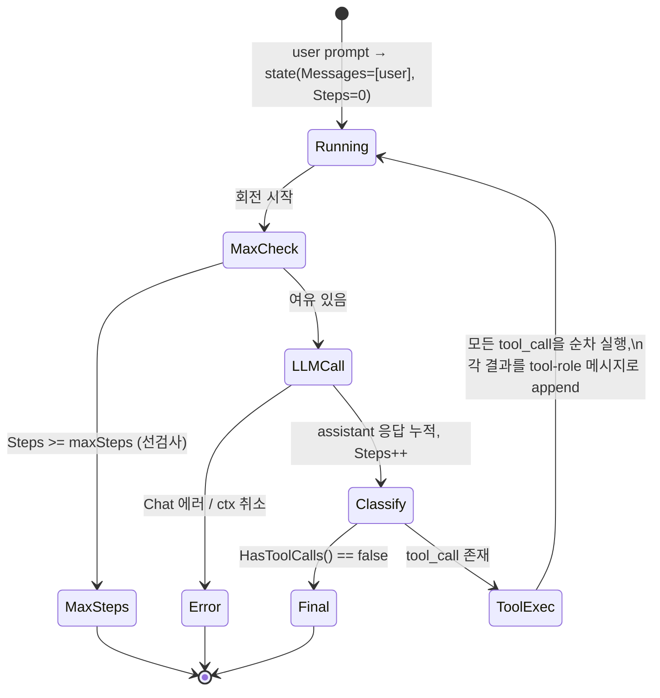

# phase-3-tool-calling — analysis

## 근거

읽은 spec.md: `docs/20260608-001-phase-3-tool-calling/spec.md` 전체(§1 범위 ~ §5 완료
조건 12개). 본 분석의 scope ceiling은 이 spec이며, ROADMAP Phase 3 섹션(목표·완료 기준)과
교차 확인했다. Phase 4(Graph)·Phase 5(추가 tool·middleware)·Phase 9(MCP) scope는 spec
§4 제외 범위에 따라 끌어오지 않는다.

코드베이스에서 확인한 사실(추정 아님):

- `internal/message/message.go` — `ToolCall{ID,Name,Input json.RawMessage}`,
  `ToolResult{ToolCallID,Content,IsError}`, `ToolSpec{Name,Description,InputSchema
  json.RawMessage}`, `ContentBlock{Type,Text,ToolCall,ToolResult}`, `BlockType`(text/
  tool_call/tool_result), `Role`(user/assistant/tool/system), 생성자
  `NewTextBlock`/`NewToolCallBlock`/`NewToolResultBlock`, `Message.HasToolCalls()`가
  **이미 존재**한다. Phase 3은 이 타입들을 재사용하며 재정의·확장하지 않는다. message
  패키지는 다른 internal 패키지를 import하지 않는다(파일 주석으로 확인).
- `internal/llm/llm.go` — `ChatRequest{Model, Messages, Tools []message.ToolSpec}`가
  이미 `Tools` 필드를 가진다. 즉 등록된 tool schema를 LLM에 싣는 경로는 타입 차원에서
  이미 열려 있고, Phase 3은 이 필드를 **채워 보내는** 호출부만 추가하면 된다.
- `internal/llm/claude.go:121` — `claudeToolsFromInternal(req.Tools)`가 이미
  `ChatRequest.Tools`를 Claude API tool 정의로 변환한다. 따라서 §5.3·§5.11의 "schema를
  실어 보낸다"는 agent가 `ChatRequest.Tools`를 채우기만 하면 provider 변환은 기존 코드가
  처리한다.
- `internal/agent/agent.go` — Phase 2 loop의 정확한 변경 지점은 `Run`의 단계 (6)
  `agent.go:118~123`이다. 현재 `resp.Message.HasToolCalls()`가 true일 때 주석대로
  "running 유지하며 다음 회전으로"만 하고 **tool을 실행하지 않는다**(신호로만 취급).
  단계 (4) `agent.go:104~107`의 `ChatRequest`는 `Tools`를 채우지 않는다. Phase 3이 메우는
  gap이 정확히 이 두 곳이다. max step 선검사(단계 (3), `agent.go:98~101`)와 에러 흡수
  (단계 (4)의 `err != nil` 분기), step counter 증가(단계 (5))는 그대로 유지된다.
- `cmd/agent-runtime/main.go:66` — `run`이 `agent.NewAgent(client, model, maxSteps,
  nil)`로 Agent를 만든다. `defaultMaxSteps = 10` 상수(`main.go:19`)를 생성 인자로 넘기는
  것이 Phase 2 D8의 "config 미노출, 생성 인자 + CLI 기본 상수" 패턴이다. tool/registry도
  같은 패턴으로 주입한다.
- stub 테스트 컨벤션 — `internal/agent/agent_test.go`의 `seqStub`은 `responses
  []llm.ChatResponse`를 순서대로 반환하고(시퀀스 소진 시 마지막 반복), ctx 취소를 먼저
  존중하며 `calls`를 기록한다. 이것이 Phase 2 D7에서 채택한 "agent 테스트 내 다단계 stub,
  `internal/llm` 미변경" 패턴이다. Phase 3 §5.12 검증은 이 패턴을 그대로 재사용한다.

의존성 탐색 trace(§4 근거):

- `NewAgent` 호출자: `cmd/agent-runtime/main.go:66`(production 1곳), `internal/agent/
  agent_test.go:85,136,176,219`(테스트 4곳). 외 없음(repo 전체 grep).
- `Run` 호출자: `cmd/agent-runtime/main.go:67`, `internal/agent/agent_test.go:87,138,
  178,220`. 외 없음. → `Run`의 시그니처는 바꾸지 않는다(아래 D3).
- `ChatRequest.Tools`를 채우는 호출자: **현재 없음**(grep으로 `.Tools` 대입 0건,
  `claude.go:121`은 읽기만). 즉 Phase 3 전까지 `Tools`는 항상 비어 나갔다. Phase 3에서
  agent가 처음으로 이 필드를 채운다.
- `ChatRequest{}` 리터럴 생성: `agent.go:104`(production), 테스트들. agent만 production
  경로에서 ChatRequest를 만든다.

추정으로 분리: 구체 calculator의 연산 집합 범위, file read의 허용 base 경로 결정값,
timeout 기본값(초 단위) 같은 구체 수치는 spec이 강제하지 않으므로 §5 Decision Points에서
방향만 정하고 정확한 상수·산술 파서 형태는 implement.md 소관으로 남긴다.

## 1. 구조

경계 단위로 본다. 새 패키지 `internal/tool`과 기존 `internal/agent`의 협력으로 Phase 3을
구성한다.

새 패키지 `internal/tool` — tool 실행 런타임 계층:

- `Tool` 추상화: 자신의 이름과 입력 schema(`message.ToolSpec`)를 노출하고, ctx와 raw
  JSON 입력을 받아 실행되는 단위. 구체 구현체(calculator, file read)는 이 추상화 뒤에
  숨고 agent는 구체 타입을 모른다(spec §3 "registry/추상화 뒤에서 실행").
- `Registry`(spec의 `ToolRegistry`): 이름 → `Tool` 매핑. register(충돌 처리 포함),
  이름 lookup(unknown 구분), 등록된 모든 tool의 schema 수집(`[]message.ToolSpec`)
  표면을 가진다(§5.1·§5.2·§5.3).
- tool 실행·검증·timeout·결과 정규화의 거처: 이 책임을 registry나 별도 dispatcher가
  지게 할지(§5 D2)에 따라 위치가 갈리지만, **어디에 두든 `internal/tool` 안에 둔다.**
  agent는 "이 tool_call을 실행해 ToolResult를 받아라"라는 한 줄 호출만 한다. 즉 입력
  검증 실패·실행 에러·timeout·unknown을 `message.ToolResult`(IsError 표시)로 정규화하는
  로직 전부가 tool 패키지에 응집된다(spec §1, §3).
- 구체 tool 2종: calculator(산술 입력 → 계산 결과 ToolResult), file read(허용된 base
  경로 하위 파일 내용 → ToolResult, 범위 밖·부재 경로는 에러 ToolResult). 둘 다 `Tool`
  추상화를 구현한다(§5.9·§5.10).

기존 패키지 `internal/agent` — loop가 tool 실행을 구동:

- `Agent`가 registry(또는 tool 묶음)를 들도록 생성 표면을 넓힌다(D3).
- `Run`의 LLM 호출 단계가 `ChatRequest.Tools`에 registry의 수집 schema를 채운다.
- `Run`의 tool_call 분기가 신호 취급을 멈추고, assistant 응답의 모든 tool_call 블록을
  순차로 registry에 위임 실행한 뒤, 그 결과들을 tool-role 메시지로 state에 누적하고 다음
  회전을 돈다(§5.4·§5.5). agent는 정규화 책임을 지지 않는다 — 받은 `message.ToolResult`를
  메시지로 감싸 append할 뿐이다.

내부 헬퍼(산술 파서, 경로 sanitize, JSON unmarshal)는 경계가 자명하므로 타입명을
박지 않는다.

## 2. 데이터 흐름

상태와 경계를 가로지르므로 다이어그램과 함께 본다.



도달 가능한 상태와 전이 trigger:

- `running` → `max_steps`: 회전 진입 시 `Steps >= maxSteps`(선검사, Phase 2 그대로 유지).
- `running` → `error`: `client.Chat`이 에러 반환(ctx 취소 포함). Phase 2와 동일.
- `running` → `final`: assistant 응답에 tool_call이 없음.
- `running` → `running`(회전): assistant 응답에 tool_call이 있어 실행 후 결과 누적.

tool_call이 있을 때의 세부 흐름(한 회전 안):

1. assistant 응답의 ContentBlock들을 순회하며 `BlockTypeToolCall` 블록만 골라 순차
   처리한다(§4 제외에 따라 병렬 없음).
2. 각 `ToolCall.Name`으로 registry lookup.
   - **unknown tool**: 해당 이름이 없으면 본체 실행 없이 `IsError=true`, Content에
     "unknown tool: <name>" 류 메시지를 담은 `ToolResult`로 정규화(§5.7).
3. tool을 찾았으면 입력 검증 단계로 간다.
   - **검증 실패**: `ToolCall.Input`이 tool이 기대하는 형태로 풀리지 않으면 본체 실행 없이
     `IsError=true` ToolResult(§5.6).
4. 검증 통과 시 loop ctx에서 파생한 timeout ctx로 `Execute(ctx, input)` 호출.
   - **실행 에러**: 본체가 에러 반환 → `IsError=true` ToolResult(§5.8 전단).
   - **timeout**: ctx deadline 초과 → `IsError=true` ToolResult(§5.8 후단). 패닉·loop
     중단으로 가지 않는다.
   - **성공**: 결과 문자열을 `IsError=false` ToolResult로 정규화(§5.9·§5.10 성공 경로).
5. 모든 ToolResult를 **하나의 tool-role 메시지**(또는 결과별 메시지)의 tool_result
   블록으로 만들어 `state.Messages`에 append한다. 이때 각 ToolResult의 `ToolCallID`는
   대응 `ToolCall.ID`와 묶인다.
6. 다음 회전에서 단계 (4) LLM 호출이 user + assistant(tool_call) + tool(tool_result)
   누적 메시지를 그대로 재전송하므로, 모델이 결과를 보고 이어서 판단한다(§5.5). 결국
   tool_call 없는 응답이 오면 `final`로 종료된다.

핵심: 위 4개 실패 경로(unknown·검증·실행·timeout)는 **모두 ToolResult(IsError)로
흡수**되어 loop를 깨지 않는다. 이는 Phase 2 D5의 "에러를 state에 흡수" 원칙을 tool 층으로
연장한 것이다(spec §3, §5.6·§5.7·§5.8). LLM 호출 자체의 에러만 `error` 종료 상태로 간다
(기존 동작 보존).

## 3. 인터페이스

경계를 가로지르는 계약만 본다. 내부 헬퍼는 다루지 않는다.

`Tool` 추상화(internal/tool):

```go
type Tool interface {
    Spec() message.ToolSpec                                      // 이름·설명·InputSchema 노출
    Execute(ctx context.Context, input json.RawMessage) (message.ToolResult, error)
}
```

- `Spec()`은 registry가 schema를 수집할 때(§5.3)와 lookup 시 이름 키로 쓰인다.
- `Execute`의 반환 형태(ToolResult 직접 vs (string,error))와 정규화 위치는 D1에서 결정.

`Registry` 표면(internal/tool):

- `Register(t Tool) error` — 이름 기반 등록, 충돌 시 정의된 방식으로 처리하고 호출자가
  결과 확인(§5.1).
- lookup — 이름으로 `Tool`을 찾고 unknown을 구분(§5.2). agent가 직접 lookup하느냐, 아니면
  registry가 "tool_call 하나를 받아 ToolResult를 돌려주는" 실행 표면을 제공하느냐는
  D2에서 결정.
- `Specs() []message.ToolSpec` — 등록된 모든 tool의 schema 수집. 이 결과가 그대로
  `ChatRequest.Tools`에 실린다(§5.3·§5.11).

agent → registry 호출(internal/agent):

- LLM 호출 시: `llm.ChatRequest{Model, Messages, Tools: registry.Specs()}`로 schema를
  싣는다. (현재 `agent.go:104` ChatRequest가 `Tools`를 비워 보내는 것을 메운다.)
- tool_call 처리 시: D2 결정에 따라, 각 tool_call을 registry(또는 dispatcher)에 넘겨
  `message.ToolResult`를 받는다.

ToolResult → Message 매핑:

- 받은 `message.ToolResult`를 `message.NewToolResultBlock(tr)`로 감싸고, `Message{Role:
  RoleTool, Content: [...tool_result 블록]}`로 만들어 `state.Messages`에 append한다.
  이 매핑은 기존 message 생성자만으로 성립하며 새 타입이 필요 없다.

## 4. 영향 범위

실제로 건드리는 기존 모듈/파일만 적는다.

- `internal/agent/agent.go` — (a) `Run`의 LLM 호출 단계 `ChatRequest.Tools`를 채운다.
  (b) tool_call 분기(`agent.go:118~123`)를 신호 취급에서 실제 실행+결과 누적으로 바꾼다.
  (c) `Agent` 구조체와 `NewAgent`가 registry(또는 tool 묶음)와 timeout을 들도록 생성
  표면을 넓힌다(D3). max step 선검사·에러 흡수·step 증가 로직은 유지한다.
- `cmd/agent-runtime/main.go` — `run`이 registry를 만들어 calculator·file read tool을
  등록하고 `NewAgent`에 주입한다(§5.11 end-to-end). `defaultMaxSteps` 상수와 같은
  패턴으로 timeout 기본값도 여기서 넘긴다(D5).
- `internal/agent/agent_test.go` — `NewAgent` 시그니처가 바뀌면 4개 호출부(`:85,136,176,
  219`)의 인자를 갱신해야 한다(backward-compat 깨짐, 아래). §5.12 검증용 신규 테스트도
  여기/별도 테스트 파일에 추가한다(D10).
- `cmd/agent-runtime/main_test.go` — `run` 시그니처는 유지하나, 내부에서 registry를 쓰면
  기존 테스트(text final / max steps / chat error / ctx cancel)가 그대로 통과하는지
  확인이 필요하다. tool 미등록 상태에서도 기존 4 케이스는 의미가 보존된다.

신규: `internal/tool/` 패키지 파일들과 그 테스트(새로 만드는 것이므로 "영향"이 아니라
추가).

backward-compat 판단: `NewAgent` 시그니처가 바뀌면(D3) production 호출 1곳(`main.go:66`)과
테스트 4곳이 ripple된다. 이는 grep으로 확인한 전부이며(§근거 trace) 모두 같은 repo 안이라
한 번에 갱신 가능하다. `Run`은 호출부 전부가 `(ctx, prompt)`만 쓰므로 시그니처를 **바꾸지
않는다** — registry는 생성 시점에 Agent가 들고 있게 한다. `internal/message`·
`internal/llm` 타입 정의는 손대지 않는다(Phase 2 D7과 동일, spec §3 "타입 재사용").

## 5. Decision Points

### D1. `Tool`이 schema·execute를 노출하는 형태와 정규화 위치

- 옵션 A: `Spec() message.ToolSpec` + `Execute(ctx, json.RawMessage) (message.ToolResult,
  error)`. tool이 성공 결과를 ToolResult로 직접 채우되, 반환 error가 non-nil이면 runtime이
  그것을 `IsError=true` ToolResult로 정규화한다.
- 옵션 B: `Execute(ctx, json.RawMessage) (string, error)`. tool은 평문만 내고, ToolResult
  조립(ToolCallID·IsError 결정)은 전부 runtime이 한다.
- 옵션 C: tool이 schema를 별도 메서드(`Name()`+`InputSchema()`) 분리로 노출.
- 트레이드오프: B는 tool 구현을 가장 단순하게 하지만, 성공 시에도 runtime이 Content를
  어떻게 직렬화할지 한 군데로 강제돼 tool별 표현 자유가 준다. C는 ToolSpec이 이미 한 타입
  (`message.ToolSpec`)으로 묶여 있는데 굳이 쪼개 응집을 깬다.
- 채택: **A**. 근거: `message.ToolSpec`·`message.ToolResult`가 이미 존재하므로 그 타입을
  그대로 입출력에 쓰는 게 spec §3의 "타입 재사용"에 가장 곧다. 단 `ToolCallID`는 tool이
  알 수 없으므로(call 단위 정보) runtime이 반환 ToolResult에 채워 넣고, error 반환은
  runtime이 IsError ToolResult로 정규화한다. 즉 **성공 Content는 tool이, IsError 정규화와
  ToolCallID 결합은 runtime이** 책임진다. 정규화 로직은 `internal/tool`에 둔다(§1).

### D2. tool_call 처리 로직의 거처

- 옵션 A: `agent.Run` 안에서 직접 lookup → 검증 → Execute → 정규화까지 인라인.
- 옵션 B: `internal/tool`에 dispatcher 표면을 두어, agent는 "이 tool_call(또는 묶음)을
  실행해 ToolResult를 달라"만 호출한다.
- 트레이드오프: A는 호출 한 단계가 줄지만 검증·timeout·정규화·unknown 처리까지 agent.go에
  몰려 Phase 2의 작고 읽히는 loop 응집이 깨진다. B는 tool 실행 정책을 tool 패키지에
  응집시키고 agent는 "결과를 받아 메시지로 누적"이라는 loop 본업만 남긴다.
- 채택: **B**. 근거: spec §3은 agent가 "registry/추상화 뒤에서" tool을 실행하라고 명시한다.
  검증·timeout·정규화·unknown은 tool 실행 정책이므로 `internal/tool`에 두는 것이 경계상
  옳고, agent.go는 Phase 2의 cohesive한 loop를 보존한다(§1·§4). dispatcher가 registry
  자체의 메서드인지 별도 타입인지는 implement.md 소관.

### D3. `NewAgent`가 tool을 받는 경로

- 옵션 A: `NewAgent`에 registry(또는 dispatcher) 인자를 추가한다.
- 옵션 B: `[]Tool`을 받아 내부에서 registry를 만든다.
- 옵션 C: `AgentConfig` 구조체를 도입해 거기에 담는다.
- 트레이드오프: C는 Phase 2 D8이 명시적으로 거부한 방향이다("maxSteps as constructor
  arg, not config"). B는 등록 충돌 처리(§5.1)를 agent 내부로 숨겨 호출자가 충돌 결과를
  확인하기 어렵게 한다. A는 호출자가 registry를 먼저 만들어 등록·충돌 확인을 마친 뒤
  주입하므로 §5.1의 "호출자가 결과를 확인"과 맞고, schema 수집(§5.3)도 registry가 책임진다.
- 채택: **A(registry를 생성 인자로 주입)**. 근거: Phase 2 D8의 "생성 인자, config 아님"
  일관성을 지키고, registry를 main이 구성·등록·검증한 뒤 넘기는 흐름이 §5.1·§5.11에
  맞는다. ripple은 §4에 기록한 호출 5곳으로 한정된다. timeout도 같은 D8 패턴으로 생성
  인자(또는 상수)로 받는다(D5 참조).

### D4. 입력 검증 전략

- 옵션 A: registry/dispatcher가 `InputSchema`(JSON Schema)로 일반 검증한다.
- 옵션 B: 각 tool의 `Execute`가 자기 입력을 unmarshal하며 스스로 검증하고, 실패를 error로
  반환한다(runtime이 IsError ToolResult로 정규화).
- 트레이드오프: A는 일관되지만 JSON Schema validator 의존을 새로 들여야 한다 — spec §3의
  "라이브러리 추가 자제"(LangChain 금지 맥락)와 "무거운 의존 없이"라는 기조에 어긋난다.
  B는 tool마다 unmarshal+필드 검사를 직접 하지만 표준 `encoding/json`만으로 충분하고,
  검증 실패가 D1의 error 경로를 타 §5.6 그대로 충족한다.
- 채택: **B(tool 자체 unmarshal·검증)**. 근거: 새 무거운 의존 없이 §5.6(검증 실패 시 본체
  미실행 + 에러 ToolResult)을 만족하는 가장 단순한 선택이다. `InputSchema`는 LLM에 schema를
  알리는 용도(§5.3)로만 쓰고 runtime 검증의 단일 출처로 삼지 않는다. 단 "본체 실행 전
  검증"을 보장하기 위해, 각 tool은 Execute 진입 직후 unmarshal·필드 검증을 먼저 하고
  실패면 즉시 error를 반환하는 규약을 따른다.

### D5. tool 실행 timeout

- 옵션 A: loop ctx에서 파생한 per-tool deadline(`context.WithTimeout`), timeout 값은
  Agent 생성 인자.
- 옵션 B: 동일하되 timeout 값은 `internal/tool`(또는 agent)의 고정 상수.
- 트레이드오프: spec §3·§5.8은 "개별 tool 실행이 무한히 매달리지 않음"만 요구하지 설정
  노출을 요구하지 않는다. A는 D8 패턴(생성 인자)과 일관되고 테스트에서 짧은 timeout을
  주입해 §5.8 timeout 경로를 결정적으로 만들기 쉽다. B는 단순하지만 테스트가 실제 시간을
  기다려야 해 결정성이 약해진다.
- 채택: **A(생성 인자 + CLI 기본 상수)**. 근거: Phase 2 D8(maxSteps)과 동형. CLI는
  `defaultMaxSteps`처럼 timeout 기본 상수를 넘기고, 테스트는 짧은 값으로 timeout 경로를
  결정적으로 검증한다. per-tool ctx는 항상 loop ctx에서 파생해 상위 취소·전체 timeout도
  함께 전파되도록 한다(spec §3 "context로 취소·timeout 전파"). 구체 기본 초 단위 값은
  implement.md 소관.

### D6. 성공·실패·unknown·timeout의 결과 정규화

- 네 경로 모두 `message.ToolResult`로 수렴하되 `IsError`로 구분한다:
  - 성공: `IsError=false`, Content = tool 결과(D1대로 tool이 채움), ToolCallID = 대응
    call.ID(§5.9·§5.10 성공).
  - 검증 실패: `IsError=true`, Content = 검증 실패 사유. 본체 미실행(§5.6).
  - unknown tool: `IsError=true`, Content = "unknown tool" 사유(§5.7).
  - 실행 에러/timeout: `IsError=true`, Content = 에러/timeout 사유(§5.8).
- 트레이드오프 없음(설계 규약). 핵심은 **에러를 throw하지 않고 ToolResult로 흡수**한다는
  점이며, 이는 Phase 2 D5의 "에러를 state로 흡수"를 tool 층으로 연장한 것이다. loop는 어떤
  실패에서도 중단되지 않고 다음 회전에서 모델에 결과를 피드백한다(§5.5).

### D7. 한 응답에 여러 tool_call

- spec §4가 병렬 실행·실행 순서 최적화를 명시적으로 제외한다.
- 채택: **순차 실행**. assistant 응답의 tool_call 블록을 등장 순서대로 하나씩 실행하고,
  **모든 ToolResult를 누적 append한 뒤** 다음 LLM 회전으로 넘어간다(중간에 LLM을 부르지
  않는다). 각 ToolResult의 ToolCallID로 어느 call의 결과인지 결합한다(§5.4·§5.5).

### D8. max step과의 상호작용

- tool을 실행한 회전도 한 step으로 센다(단계 (5)의 `Steps++`는 tool 실행 여부와 무관하게
  assistant 응답 1건당 1회). max step 선검사(단계 (3))는 회전 진입 시점에 그대로 작동하므로,
  tool_call이 무한히 반복돼도 `Steps >= maxSteps`에서 `max_steps`로 안전 종료한다.
- 채택: **선검사 유지, tool 회전도 step에 카운트**. 근거: Phase 2의 무한 loop 방지 불변식을
  깨지 않은 채 tool loop도 상한이 강제된다(spec §3 "무한히 매달리지 않음"의 loop 차원 보장,
  ROADMAP Phase 2 완료기준 "max step 안전 종료" 유지). tool 실행이 추가돼도 LLM 호출 횟수 ≤
  maxSteps 불변식(`agent_test.go:155`의 핵심 단언)이 보존된다.

### D9. calculator·file read의 입출력 형태와 file read 경로 제한

- calculator: `{"expression": "..."}` 또는 `{op, a, b}` 류 산술 입력을 받아 계산 결과
  문자열을 Content로 반환(§5.9). 잘못된 식·미지원 연산은 D4·D6대로 IsError ToolResult.
  복잡한 수식 파서까지 가지 않고 spec이 요구하는 "산술 입력 → 계산 결과" 최소를 만족한다.
- file read: `{"path": "..."}`를 받아 허용 범위 하위 파일 내용을 Content로 반환(§5.10).
- 경로 제한 옵션:
  - 옵션 A: base 디렉터리를 tool 생성 시 고정하고, 입력 경로를 base 기준으로 정규화한 뒤
    base 밖(상위 traversal `..`, 절대경로 이탈)을 거부.
  - 옵션 B: 임의 경로 허용 후 blocklist.
- 트레이드오프: B는 누락 시 위험하고 spec §3 "허용된 범위 밖 거부"에 약하다. A는 over-
  engineering 없이 "base + traversal 차단"만으로 §5.10·spec §3을 충족한다.
- 채택: **A(base 디렉터리 + traversal 차단)**. 근거: spec §3·§5.10이 요구하는 "허용된 범위
  밖 접근 거부"를 최소 비용으로 만족한다. 범위 밖 경로·존재하지 않는 파일은 모두 IsError
  ToolResult로 거부(§5.10, §5.8 흡수 규칙과 일관). base 경로 결정값은 implement.md 소관.

### D10. 결정적 multi-step 테스트

- 옵션 A: `internal/agent`(또는 신규 테스트 파일)에 다단계 stub을 두고, tool_call 응답
  → (tool 실행) → final text 응답 시퀀스를 주어 tool 실행 경로를 검증한다.
  `internal/llm`은 건드리지 않는다.
- 옵션 B: 공용 `StubClient`를 다단계로 확장.
- 트레이드오프: B는 Phase 2 D7이 거부한 방향(Phase 1 공용 stub 의미 확장, 범위 외 파급).
  A는 기존 `seqStub` 패턴(`agent_test.go:16~42`)을 그대로 재사용한다.
- 채택: **A**. 근거: Phase 2 D7과 동일하게 `internal/llm` 경계를 보존하면서 §5.12의 "stub
  client + 등록 tool만으로 tool 실행 → 결과 누적 → 최종 답을 실제 API 없이 결정적 검증"을
  만족한다. 구체 케이스: 실제 calculator/file read tool(또는 결정적 fake tool)을 in-test
  registry에 등록하고, stub이 1회전에 그 tool의 tool_call을, 2회전에 tool_result를 본
  뒤의 final text를 반환하도록 시퀀스를 짜면, tool 실행 경로와 결과 누적이 한 테스트로
  관찰된다. ROADMAP 중단 기준의 "관찰 가능한 실패 케이스"는 unknown tool 또는 검증 실패
  케이스를 추가해 §5.7·§5.6과 함께 충족한다.
